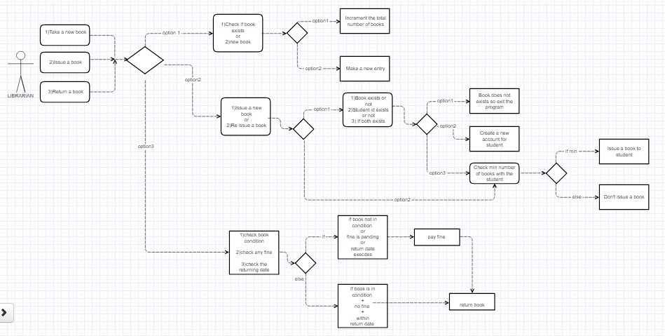

The project is about the functioning of library.
There are four classes->

1)Library class	
		{
		this class is the main class which handles all the functioning of library.
		}

2)DBConnection class
		{
	this class is used to establish connection with database before every query.
	it has two function->
		createdbconnection().
		closedbdconnection().
		}
3)Library class
		{
		now this class handles all the function/work that has to be performed by librarian.
		so this class has three main function/work.
		TakeABook().
		IssueNewBook().
		ReturnABOOK().
	
				
		TakeABook().->  MatchbookId().		
				totalBook().
				UpdateBoksTable().
				InsertBookRecords().

		IssueNewBook()->CheckIdStatus().
				CreatingNewId().
				IssueingTheBook().
				LastUpdation().
				UpadteStudentRecord().	
				TotalBookFromStudent().
				reIssueBook().

		ReturnABOOK()-> checkBeforeReturn().
				DecideFine().
		}

TakeABook().->  when a fresh books arrived in library then that books are checked , whether it is all ready 
present in library or not .so this work is done by CheckBook().If book is present then total number of that 
book present in library is achieved by funtion->TotalBook().After getting total number of books ,whole number 
of books are updated in library by function->UpdateQuiry(). Now if book is not resent then all detail are 
taken of that book and store in library.   

IssueABook()-> first it is checked whether the student want to issue new book,or reissue a book . If student 
want to issue new book,then it checked whether that student has library id or not.If student has id then book 
id is asked from student to check whether that book is in library.If all goes well then the book is issued to 
the student.Before issuing book it is checked whether the student has same book and also the returning 
date.If student has same book then the book cannot be issued . Now if student is not having account then the 
account is created.While re-issue , the total book,fine and returning date is checked.If all goes in favour of
student then the book is issued.

ReturnABook()->when student comes to return the book,then the returning date of book is checked ,if that date
is smaller then the current date then fine is charged.After that it is asked from student that whether he/she
want to pay, if yes then total fine is checked and the amount is asked from student.After accepting the money
total fine is updated and book is kept back.

4)Student class
		{
		now this class handles all the work that student can do in library,like student can see all 
		books in library or can check its own account status.
	
		Main function->SeeAccount()->librarybook()
			     	
		}

SeeAccount()->the work of this function is to show all the issued book to the student and all the fine on all
books.

librarybook()->this function shows all the books in library with each detail.

This image shows the flow of library.

